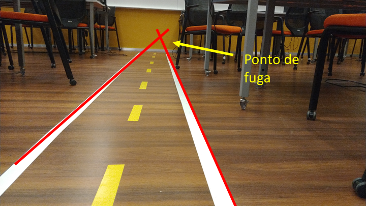
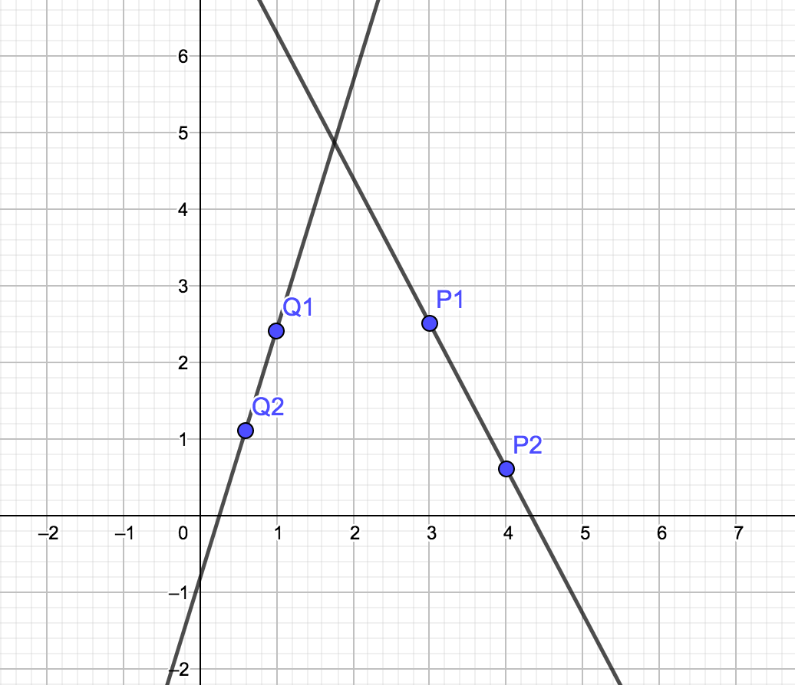

# APS 2 - Visão Computacional

**Importante:** Sempre desenvolvam nos arquivos `.py` dos respectivos exercícios.

**Aviso 1:** Não modifique o arquivo de teste, `test.py`.

**Aviso 2:** Lembre-se de dar commit e push no seu repositório até o horário limite de entrega.

**Aviso 3:** Preencha o nome completo dos integrantes do seu grupo no arquivo `README.md` do seu repositório.

## Teste seu código

Para testar seu código, execute o  teste automático usando o comando abaixo no terminal:

```bash
pytest test.py
```

Para testar apenas um exercício:

```bash
pytest test.py::test_ex1
```

Caso aparece um erro de `ModuleNotFoundError`, execute o comando abaixo no terminal:

```bash
pip install pytest
```

Se discordar do resultado do teste, verifique se seu código está seguindo o que foi pedido, leia com atenção o enunciado e a saída do teste. Se ainda assim discordar, entre em contato com os professores ou outro membro da equipe da disciplina.

Alguns exercícios possuem um resultado esperado que você pode usar para conferir o seu resultado.
___


# Exercício 1

Robôs que trabalham dentro de prédios precisam saber seguir corredores.

Uma das maneiras de fazer isso é o robô alinhar o centro de sua câmera ao ponto de fuga do corredor, para que sua trajetória seja aproximadamente paralela às paredes do mesmo.


O ponto de fuga é aquele para o qual as retas paralelas parecem convergir

Dada a seguinte imagem de um corredor:



Podemos traçar as linhas geradas pela perspectiva, seu ponto de encontro será o ponto de fuga.


## Revisão
### Reta Passando por Dois Pontos




Seja o ponto $A:(a_x, a_y)$ e o ponto $B:(b_x, b_y)$

Queremos encontrar uma reta $r: y = mx + h$ que passa por $A$ e $B$, em que $m$ é o *coeficiente angular* e $h$ é o intercepto ou coeficiente linear da reta.

Temos que:

$m = \frac{\Delta_y}{\Delta_x} = \frac{b_y - a_y}{b_x - a_x}$

Uma vez encontrado o valor de $m$, a substituição a seguir permite encontrar a equação da reta:

$m = \frac{y - a_y}{x - a_x}$

$mx - ma_x = y - a_y$

$mx = y - a_y + ma_x$

$y = mx -ma_x + a_y$

$h = a_y - ma_x$


$y = mx - ma_x + a_y$

### Interseção de Ruas Retas

Temos que na interseção as duas retas se encontram num ponto $(x_i, y_i)$

Sejam as retas $r1: y = m1x + h1$ e $r2: y = m2x + h2$

Vamos encontrar o ponto $x_i$ em que os valores de $y_i$ serão iguais:

$m1x_i + h1 = m2x_i + h2$

$(m1 - m2)x_i = h2 - h1$

$x_i = \frac{h2 - h1}{m1 - m2}$

$y_i = m1x_i + h1$

### Dados de teste:

Caso precise testar seu código, você pode conferir com estes valores. As retas definidas por pontos $r1: (P_1, P_2)$ e $r2: (Q_1, Q_2)$, para os valores:

```python

p1 = (3.0, 2.5)
p2 = (4.0, 0.6)
q1 = (1.0, 2.4)
q2 = (0.6, 1.1)
```

Encontram-se no ponto `(1.7572 4.8611)`

## Tarefa

O objetivo deste exercicio é encontrar o ponto de fuga da pista através do encontro das retas brancas que delimitam o corredor. Para isso você deve:

1. Filtrar a imagem para obter apenas as linhas brancas do corredor.

2. Utilizar o filtro de Canny para encontrar as bordas das linhas na máscara.

3. Utilizar a transformada de Hough para encontrar as linhas na imagem.

4. Filtrar as linhas encontradas para obter apenas uma linha para cada lado do corredor. Vide sugestão abaixo.

5. Encontrar o ponto de fuga a partir do encontro das retas.

6. Desenhar o ponto de fuga na imagem e executar executar seu código no vídeo `TODO.mp4`.


**Sugestão:** 

A partir do coeficiente angular, selecionar uma reta mais à esquerda e uma mais à direita para encontrar a interseção.

Lembre-se de que na OpenCV o eixo y fica **para baixo**, por isso os coeficientes angulares se comportam como na figura abaixo:


___


# Exercício 2

Neste exercício vamos utilizar as detecções da mobilenet em um problema de 'tracking'. Em visão computacional, tracking é o processo de identificar e rastrear objetos em movimento em uma sequência de imagens.